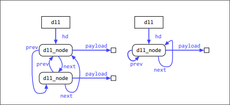
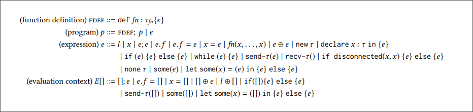
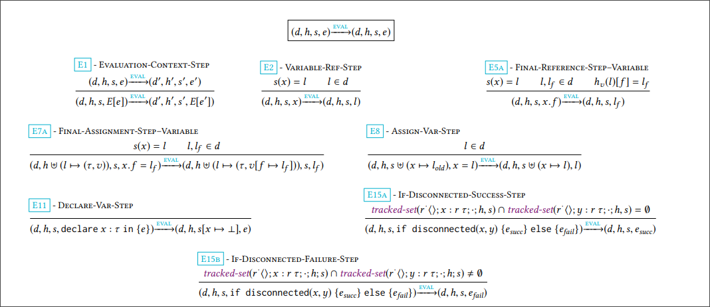
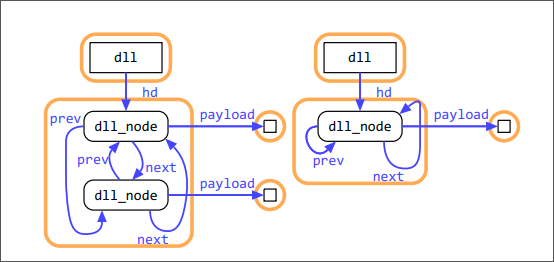
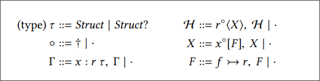

# A Flexible Type System for Fearless Concurrency

## Abstract
This paper proposes a new type system for concurrent programs, allowing threads to exchange complex object graphs without risking destructive data races. While this goal is shared by a rich history of past work, existing solutions either rely on strictly enforced heap invariants that prohibit natural programming patterns or demand pervasive annotations even for simple programming tasks. As a result, past systems cannot express intuitively simple code without unnatural rewrites or substantial annotation burdens. Our work avoids these pitfalls through a novel type system that provides sound reasoning about separation in the heap while remaining fexible enough to support a wide range of desirable heap manipulations. This new sweet spot is attained by enforcing a heap domination invariant similarly to prior work, but tempering it by allowing complex exceptions that add little annotation burden. Our results include: 
+ code examples showing that common data structure manipulations which are difcult or impossible to express in prior
work are natural and direct in our system, 
+ a formal proof of correctness demonstrating that well-typed programs cannot encounter destructive data races at run time, and 
+ an efcient type checker implemented in Gallina and OCaml.


## 1 Introduction
The promise of a language with lightweight, safe concurrency has long been attractive. Such a language would statically ensure freedom from destructive races, avoiding the cost of synchronization except when concurrent threads explicitly communicate. Our goal is to obtain this “fearless concurrency” for a language with pervasive mutability at its core. Broadly speaking, past eforts to design such a language fall into three camps. Some, like Rust, simplify reasoning by severely limiting the shape of representable data structures—making the implementation of common data structures, like the doubly linked list, unapproachable by nonexperts1. In others, harsh limitations on aliasing cause data structure traversal and manipulation to involve signifcant mutation of the object graph even for simple computations—for example, in these systems removing the tail of a recursively linear singly linked list incurs a write to each list node traversed. Existing approaches that avoid either pitfall require signifcant programmer annotation to explain aliasing information directly to the compiler.

This paper introduces a new type system for fearless concurrency. As in prior work, the goal is to statically ensure that at any point during execution, the part of the heap accessible to a given thread—what we call its reservation—is disjoint from the reservations of all other threads. Inspired by Tofte and Talpin, the object graph is partitioned into a set of regions, a purely compile-time construct which groups objects that enter or leave a thread’s reservation as a unit. Neither regions nor reservations are fxed; both can and should change during program execution to refect the movement of objects among threads. As in prior work, our type system supports both inter- and intra-region references; intra-region references may freely link objects within the same region, allowing programmers to easily form arbitrary object graphs, while inter-region references are tracked by the type system and stored in appropriately annotated isolated field. By tracking this information, the type system ensures that threads do not reference objects outside their reservations. Unlike in prior work, this guarantee is provided without requiring that isolated feld references satisfy a global domination invariant at all times—and without requiring any annotations from the programmer except at function boundaries.


For rich object graphs, this increased expressive power poses a challenge: to soundly approximate reservations at run time, the type system must accurately determine to which region each accessed object belongs, and further, which regions are contained within the reservation at run time. This determination is made particularly difcult because reservations can grow and shrink dynamically as threads exchange portions of the object graph. 

Our key insight begins by leveraging domination properties in the heap to force isolated feld references to dominate their reachable subgraphs, yielding a notion of encapsulation similar to prior work. We then temper this strong and restrictive global domination property with a new focus mechanism inspired by Vault: objects may become temporarily focused, causing their isolated field’ targets to be explicitly tracked by the type system, and thereby exempted from domination requirements. This weaker heap invariant, which we call tempered domination, allows greater fexibility with lower annotation overhead than in any prior language. It improves on traditional afne-reference languages by enforcing a tree of regions rather than a tree of objects, allowing more natural structures than are possible in Rust. On the other hand, the focus mechanism skirts the need to maintain a global domination invariant at all times, avoiding the destructive read or swap primitives needed in existing tree-of-regions languages such as L42, LaCasa, Mezzo, and others .


Two more novel features enhance expressiveness of our language:
+ a new primitive if disconnected that dynamically determines if a region can be safely split at run time, and
+ expressive function types whose parameters and results need not be dominators.


Our type system can naturally represent many mutable data structures found in prior work, without relying on heavy annotations, unnatural representations, destructive reads, or swap primitives. For example, our type system admits straightforward representations of both doubly linked lists with shared ownership and singly linked lists with recursively linear ownership, improving on a motivating example for much prior work in the frst case and ofering the celebrated mechanisms of uniqueness and borrowing popularized by Rust in the second.


This work brings together the benefts of two traditional lines of prior work without adding signifcant complexity. For example, both singly and doubly linked lists support traversal, removal, and insertion functions which look much as they would in an introductory programming class, requiring little annotation or run-time overhead. All these operations enjoy fearless concurrency: added elements may have been received from remote threads and removed elements may be immediately sent to a new thread, all without additional dynamic concurrency control mechanisms or the risk of destructive races. No existing language with fearless concurrency can as naturally express this range of data structures.


```zig
const SLList = struct {
    iso hd: ?*Node,
    
    const Node = struct {
        iso next: ?*Node,
        iso payload: *Data,
    };
};

const DLList = struct {
    iso hd: ?*Node,

    const Node = struct {
        iso payload: ?*Data,
        next: *Node,
        prev: *Node,
    };
}
```
```
struct sll_node {
    iso payload : data;
    iso next : sll_node?;
}
struct sll {
    iso hd : sll_node?;
}

struct dll_node {
    iso payload : data;
    next : dll_node;
    prev : dll_node;
}
struct dll {
    iso hd : dll_node?
}
```

> Figure 1(translated in vilya). A singly linked list and circular doubly linked list. Fields are not nullable by default; the ? annotation on types indicates that this feld stores a “maybe” of the appropriate type, efectively making it nullable. The iso keyword enforces transitive domination.


Our primary contributions are summarized as follows:
+ A new invariant, tempered domination, which allows statically tracked violations of the traditional
global domination invariant with a focus construct [23].
+ A region-based type system capable of tracking the
relationships between regions, without requiring annotations or explicit scopes to do so.
+ A formal paper proof of soundness that shows well
typed programs have no destructive data races.
+ A new primitive to dynamically discover detailed region graphs and expose them to static analysis.
+ Expressive function types capable of statically describing complex heap manipulations.
+ A type checker implemented in OCaml, and verifed
in Coq, capable of checking our most complex examples in seconds.


## 2 A Tail of Two Lists
We begin by explaining key concepts of the new type system, using two linked list implementations as guiding examples.


### 2.1 Reservations and Tempered Domination
Our language prevents destructive races by dividing the runtime heap into a set of disjoint reservations, one per thread. A thread’s reservation is the portion of the heap that it may access at any particular time. By keeping reservations disjoint, and ensuring no thread attempts to access an object outside its reservation, we guarantee freedom from destructive races; in other words, it is reservation-safe.


As the program executes and threads exchange objects, reservations must shift accordingly. When a thread sends an object to another thread, its reservation must lose access to that object’s reachable subgraph, which includes the object itself as well as all objects transitively reachable from it. Conversely, when a thread receives an object, its reservation expands; the thread gains access to the object and its reachable subgraph.


```
fn removeTail(node: *SLLNode) ?*Data {
    if let some(next) = node.next {
        if next.next == null {
            node.next = null;
            next.payload
        } else {
            removeTail(next)
        }
    } else {
        null
    }
}
```
```
def remove_tail(n: sll_node) : data? {
    let some(next) = n.next in {
        if (is_none(next.next)) {
            n.next = none;
            some(next.payload)
        } else { remove_tail(next) }
    } else { none }
}
```
> Figure 2. Removing the fnal element of a singly linked list. Note that both the returned result and list remain mutable, and the returned result is no longer encapsulated by the linked list, unlike in prior work. Note also that this function returns none on lists of size one, as it would be impossible to separate the list from its tail in this case.

The key challenge is ensuring reservation safety at compile time. Consider, for example, a linked list containing some abstract payload type data, used as a messaging queue to communicate with other threads. Two possible defnitions of such a list are found in fgure 1. While these code examples are simple, they expose two key challenges: the ability to represent cyclic data structures, and the ability to traverse trees of unique references. In order to safely add objects received from other threads to either list, or to remove objects from either list to send to other threads, the compiler must reason about reachability and aliasing, both between the list nodes and their payloads, and between the list nodes themselves.

To make this reasoning tractable for both the compiler and the programmer, our system relies on transitively dominating references: references which lie on all paths from the root of the object graph to all objects transitively reachable from that reference. These references are dominators of entire subgraphs; therefore, a thread which loses access to such a reference, for example by sending it to another thread, also loses access to its reachable subgraph. Hence, marking only this single reference as invalid maintains reservation safety. We use the keyword iso (“isolated”) to describe field which contain transitively dominating references, thereby exposing knowledge of domination in the object graph to the type system. Looking back to the example code in fgure 1, we see that iso appears on the list payloads in both linked list implementations, and that it also appears on the list spine itself in the case of the singly linked list, indicating that the only way to initially reach a singly linked list node is from its predecessor.

If all iso field contain transitively dominating references, a property we call global domination, then we can safely reason about separation in the heap when accessing such data structures. But global domination is too strong a property to be enforced at all times. For example, consider the code in fgure 2, which, given the head node, attempts to remove the fnal element from a singly linked list, returning a dominating reference. The caller of remove_tail may leverage the separation between the removed node and list parameter to, for example, safely send the removed node to a distinct thread without losing access to the list itself .

In implementing this function, this code frst attempts to dereference the argument’s next feld, storing it in the variable next. It then checks if next is the tail of the list, removing it from the list and returning its payload if so. Otherwise, it recursively calls remove_tail on the next element. Note something surprising: this code violates global domination! Both the next variable and the list parameter hold references to sll_node’s iso-declared (hence dominating) next feld.

In fact, performing a non-destructive traversal of this list while enforcing global domination over all next field is impossible; all such traversals will require at least a “cursor” variable pointing at the current position in the list, which will necessarily alias the next pointer of that position’s predecessor.

Our language thus does not enforce a traditionally strict global domination invariant; rather than forcing references stored in iso field to always be transitively dominating, we temper this requirement with a type-level mechanism that explicitly tracks the targets of some references, requiring transitive domination for exactly those references in iso field which are not explicitly tracked by the type system. We call this weakened property tempered domination.

Tempered domination generalizes prior work that relies on global domination. Crucially, tracking, and indeed the decision of which references to track, occurs without explicit user instruction—requiring annotations only at function boundaries. When we describe the mechanisms in place for preserving tempered domination in the remainder of this paper, we refer to transitively dominating references as simply dominating references.

### 2.2 Aliasing and Reachable Subgraphs
While an otherwise untracked iso feld in some object o is guaranteed to contain a dominating reference, it is not in general guaranteed that o itself is uniquely referenced; in fact many aliases of any given object may be accessible at any particular time. When checking an iso feld dereference, it is therefore necessary to ensure the program has not already accessed that same object’s iso feld from some other alias.

For example, consider the circular doubly linked list implementation from fgure 1. Figure 3 illustrates two possible instances of this list; note that a list of size 1 is represented by a single list node whose prev and next pointers are self references.


> Figure 3. Two circular doubly linked lists, of size 2 and of
size 1.
```
def remove_tail(l : dll) : data? {
    let some(hd) = l.hd in {
        let tail = hd.prev;
        tail.prev.next = hd;
        hd.prev = tail.prev;
        some (tail.payload)
    } else { none } 
```
> Figure 4. Retrieving the tail of a circular doubly linked list
(broken)

```
def remove_tail(l : dll) : data? {
    let some(hd) = l.hd in {
        let tail = hd.prev;
        tail.prev.next = hd;
        hd.prev = tail.prev;
        // to ensure disjointness for if−disconnected
        tail.next = tail; tail.prev = tail;
        if disconnected(tail,hd) {
            //l.hd invalid at branch start
            l.hd = some (hd);
            some(tail.payload)
        } else {
            l.hd = none;
            some(hd.payload) 
        }
    } else { none }
}
```
> Figure 5. Retrieving the tail of a circular doubly linked list
(fxed)

As with the singly linked list, we might wish to remove the tail from this circular doubly linked list; our frst attempt to do so is in fgure 4. This code takes advantage of the circular structure of this list, jumping straight to the end via hd’s prev pointer. After patching the list pointers to exclude the tail node, we return the iso-annotated tail.payload reference. As in the singly linked list, this function has been declared to return only dominating references, so the caller of remove_tail should be able to use this payload freely without regard for its former attachment to the list.

Sadly, this code contains an error. When passed a list of size 2, this code functions as expected; the tail node is excised from the list, removing all external references to the payload except the one returned from the function itself. But when passed a list of size 1, the code behaves diferently: hd and hd.prev are in fact the same object (fg 3), rendering inefective the assignments that attempt to remove it from the list. Here, the returned payload actually isn’t a dominating reference; the list retains the same shape as before, and still provides access to the returned payload. While the programmer could eliminate this error by swapping the payload with a dummy value, that fx is undesirable. It would satisfy the type checker, but not remove the bug—replacing a static error with a dynamic one when the dummy value is later unexpectedly encountered.

The correct fx for fgure 4 is to add code which handles lists is of length one, perhaps by adding an if-statement. But while this may be sufcient for the programmer to know the size of the list a priori, an if-statement alone would not be enough to allow the type system to make that same deduction.

To solve this, our work introduces a new primitive conditional form called if disconnected. This conditional performs a run-time check to establish if its arguments’ reachable subgraphs are non-intersecting; if they are, it enters the frst branch, and otherwise enters the else branch. We see this construct in use in fgure 5. Here, the existing logic is enhanced by replacing what was once a plain return of tail.payload to a call to if disconnected, returning tail.payload when it has been successfully disconnected in size 2+ cases, and returning the head’s payload in the size 1 case. Note that the programmer must manually repoint the tail’s next and prev field away from the remainder of the list, as disconnection is a symmetric property: it is just as essential that tail cannot reach head as it is that head cannot reach tail. Additionally, the type system does not know which of hd and tail connect to l.hd, necessitating that l.hd be reassigned even in the then branch.

Despite its dynamic nature, the run-time complexity for if disconnected is quite reasonable—in this example, it would only require reading the metadata of a single object. Notably, the new if disconnected mechanism cannot be approximated by mechanisms in similar prior work.


## 3 A Small Language with Dynamic Reservation Safety
We formalize our work as a small core concurrent language
with mutable objects, passed by reference.

### 3.1 Syntax
The syntax of the language can be found in fgure 6. Beyond standard imperative constructs, structures, and a frstclass “maybe” construct, two novel features stand out: the if disconnected primitive and blocking messaging primitives send-τ and recv-τ.


> Figure 6. Core language syntax

### 3.2 Semantics
Figure 7 presents selected rules of the small-step semantics for a single thread; explicit concurrency constructs are added in section 7. The only values are locations. The small-step confguration is largely standard, including a store h mapping locations to objects, a stack s mapping variable names to locations, and an expression e which is evaluated with reference to the store and stack.

The fnal element of the confguration, d, is not standard; this context models the (dynamic) reservation and is consulted whenever a location is used. For example, rules E2 - Variable-Ref-Step and E5a - Final-Reference-Step– Variable check d to confne variable and feld reads to locations within the reservation, and E8 - Assign-Var-Step and E7a - Final-Assignment-Step–Variable check d to confne variable and feld assignments similarly. If any expression attempts to read or write locations that are not in the current reservation, no rules apply and the program cannot step; the program intentionally “gets stuck.” By augmenting the small-step semantics with this pervasive dynamic reservation check, we can be guaranteed that—provided reservations are always disjoint—no program can destructively race. In section 4 we introduce a type system for which we have proven progress and preservation (section 6) with respect to this small-step system, in turn proving that no well-typed programs get stuck—and therefore, no reservation checks ever fail. Hence, a real implementation has no need to track the reservation or to perform such checks at run time.

In contrast to the erasable dynamic reservation checks, the if disconnected mechanism has unavoidable run-time cost. It must ensure that the object graphs reachable from its arguments are non-intersecting, as specifed in rules E15a and E15b. A naive implementation of this check would be unacceptably inefcient, as it would require a complete traversal of the object graphs reachable from both arguments; a more efcient implementation is described in section 5.2.

## 4 Type System
The type system is built around maintaining tempered domination: untracked iso field always dominate their reachable subgraph. To establish this invariant, the type system must be able to determine when two diferent isolated field may be aliases. For example, in the doubly linked list example from fgure 3, the type system must recognize that hd and hd.tail may be aliases, and so hd.payload and hd.tail.payload may be as well. It must also ensure that operations which remove an object from the current thread’s reservation also render all aliases of this object statically unusable.

### 4.1 Regions
To track aliasing, the type system usesregions to describe disjoint subgraphs of the overall object graph, statically associating each reference with a region in which its target lives. By ensuring that all possible references to the same object are labeled with the same region, the type system can use a set of regions as a conservative compile-time approximation to a run-time reservation. When an object is lost from the reservation, the type system invalidates all references to that object by preventing the use of any references that target its region. Efectively, the type system treats each region as an afne resource which is consumed by reservation-shrinking operations on its constituent objects.

For example, fgure 8 circles regions in the doubly linked
list instances of fgure 3. Entire list spines lie in the same
region, which causes the static error from in original attempt:
both hd and hd.next are in the same region, so the type
system always treats them as potential aliases.

### 4.2 Focus
The tempered domination invariant requires that untracked iso field must dominate their reachable subgraph, while tracked iso field are unrestricted. Over the course of program execution, untracked iso field may become tracked, and tracked iso field may in turn become untracked. To allow tracked iso field to be safely untracked, our type system ensures that all tracked iso field have statically known target regions. To avoid unsoundness, we must ensure that potential aliases do not have conficting static tracking information. To this end, we introduce a focus mechanism, which allows variables to become tracked only in regions in which no other variables are currently tracked. Since variables from distinct regions are necessarily distinct, this ensures no iso feld ever becomes tracked via multiple aliases. This non-aliasing behavior is formalized as invariant I6 in the appendix.


> Figure 7. Selected small-step rules. Full small-step rules can be found in the appendix.


> Figure 8. Two circular doubly linked lists, with regions drawn.


> Figure 9. Surface context defnitions for $\mathcal{H}$ and $Γ$

### 4.3 Typing Judgments and Static Contexts
The typing judgment has the form $H; Γ ⊢ e : r τ ⊣ H; Γ$, following the grammar in fgure 9. It associates an expression $e$ with $a$ type $τ$ and $a$ region $r$. Recall from section 4.1 that regions are treated linearly in the type system; the transformation of linear contexts is represented not by context splitting but by “input” (before $⊢$) and “output” (after $⊣$) contexts. The diference between input and output contexts captures $e$’s efects on the type state. To be well-formed, all static contexts $(Γ, H, X, F )$ cannot contain duplicate bindings for regions, variables, or fields.

The variable typing context $Γ$ is a largely standard binding environment recording the type and region of variables; the heap context $\mathcal{H}$ is interpreted as a set of tracking contexts of the form $r^◦ ⟨X⟩$. Each tracking context begins with a region capability $r$, the complete set of which serves to conservatively approximate the dynamic reservation. Were our tracking contexts to contain only this $r$, they would match the tracking context of LaCasa; indeed, several rules — those which introduce, check, and eliminate regions—require only this level of detail.